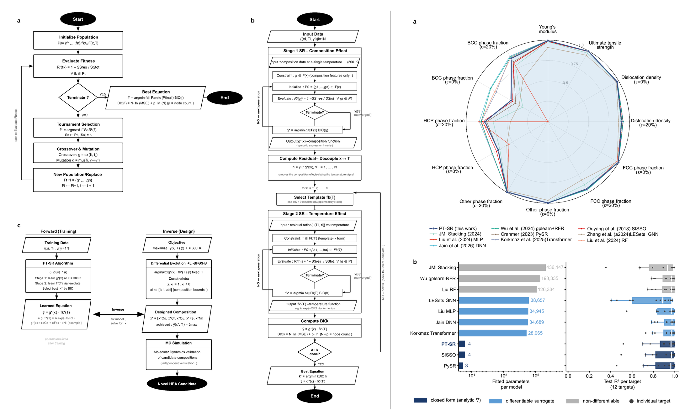

<p align="center">
  
</p>

# Physics-Templated Symbolic Regression for High-Entropy Alloys

Code and data for **"Physics-Templated Symbolic Regression discovers closed-form, differentiable equations for high-entropy alloy properties"**.

[](https://opensource.org/licenses/MIT)

## Abstract

High-entropy alloys open a composition space too large to search by experiment,
and black-box machine-learning surrogates now predict their properties with R²
above 0.99. A surrogate returns a number and not an equation, so its prediction
cannot be interpreted, inspected against physical law, or differentiated for
design. Here we constrain a symbolic-regression search with nine competing
physical templates and let a model-selection criterion elect the winner for each
property. Trained on a 684-point molecular-dynamics corpus of CoCrCuFeNi, our
method returns one closed-form equation per target property. The equation for
ultimate tensile strength reaches a test R² of 0.994 with only four parameters,
replacing a surrogate that reaches the same accuracy with 4.4 × 10⁵. Used as a
design objective, the equation extrapolates beyond the training envelope to
compositions whose measured strength exceeds the highest and falls below the
lowest in the corpus. The same procedure holds on independent experimental
alloys sharing no elements with the corpus, reaching R² above 0.97 on folds of
only four measurements, where black-box models fall below zero. The approach can
be extended to any system where candidate physical laws are available but the
form that governs the measured response is unknown.

## Layout

```
data/          the corpus, its derived features, the experimental measurements
               behind the leave-one-paper-out folds, and the two workbooks
               submitted with the paper
equations/     all 660 discovered equations, sympy-parseable
src/           the two-stage search, the nine templates, the ML and DL baselines
baselines/     the published models re-trained on this corpus
lodo/          leave-one-paper-out over eighteen folds
inverse_design/  optimisation of the closed forms and the screening benchmark
analysis/      SHAP attribution, the equivalence tests, hyperparameter sweeps,
               learning curves, supplementary figures
results/       cross-validation results and the selected hyperparameters
```

## Install

```bash
git clone https://github.com/mschongchulshin/physics-templated-symbolic-regression.git
cd physics-templated-symbolic-regression
pip install -r requirements.txt
```

PySR runs on a Julia backend, which it installs on first use:

```python
import pysr; pysr.install()
```

## Reproducing the figures

Unless noted, each command writes under `results/`.

| Figure | Command |
|---|---|
| Fig. 2a, 2b | `python src/run_sr_template.py 0 5 && python src/compile_results.py` |
| Fig. 3 | the same run, which writes the elected equation per target to `equations/` |
| Fig. 4 | `python analysis/shap_attribution.py && python analysis/shap_beeswarm.py` |
| Fig. 5 | `python lodo/make_lodo_folds_all.py && python lodo/ptsr_main_lodo.py && python lodo/baselines_lodo.py run 4` |
| Fig. 6 | `python inverse_design/run_inverse_design.py` |
| Supp. Figs. 1, 2 | `python analysis/render_supp_figs.py` |
| Supp. Figs. 3-5 | `python analysis/sr_sensitivity_worker.py <worker_id> <n_workers>` then `python analysis/sr_sensitivity_plot.py` |
| Supp. Fig. 6 | `python src/run_shuffled_y.py 0 5` |
| Supp. Fig. 7 | `python inverse_design/analysis_roc_interaction.py` |
| Supp. Note 3 | `python analysis/equivalence_tost.py` |
| Supp. Table 13 | `python analysis/hume_rothery_ols.py` |
| Optuna traces | `python analysis/optuna_convergence.py` |

The full symbolic-regression sweep is 2,700 runs and takes days on a laptop.
It does not have to be rerun to check the paper: the finished sweep is in
`results/cv_results/sr_9templates_raw.csv`, the equations are in `equations/`,
and `src/compile_results.py` reads them to reproduce every published number.

Values quoted in the paper are rounded from these files. The test R2 of 0.994
for UTS, for example, is the mean of the 25 cross-validation runs of the
elected Arrhenius template in `results/cv_results/sr_9templates_raw.csv`,
which comes to 0.9936. The equivalence tests are tabulated in `data/Source_Data.xlsx`, sheet
`Supp_Note_3_TOST`, and `analysis/equivalence_tost.py` recomputes them from
the deposited runs, reproducing all twelve comparators, p values and
verdicts.

Rerunning the search itself is a different matter. PySR is seeded
(`random_state=seed`) but runs with `deterministic=False` and `procs=1`, since
its strict determinism mode requires single-threaded evolution. A rerun
therefore recovers the same operator structure at the rate reported in the
paper rather than byte-identical expressions. Set `procs=0,
multithreading=False, deterministic=True` in `src/run_sr_template.py` for an
exact replay, at a large cost in wall time.

## Data

### Molecular dynamics, the corpus the search trains on

| File | What it holds |
|---|---|
| `data/CoCrCuFeNi_684.csv` | 232 compositions x 3 temperatures, all twelve targets. Supplementary Data 1 holds the 228 that were trained on; this adds the four held out for verification |
| `data/Supplementary_Data_1_MD_corpus.xlsx` | the same corpus as submitted with the paper |
| `data/compositions_228.csv` | the composition grid on its own |
| `data/features_13.csv` | the thirteen model inputs, per sample |
| `data/features_93_library.csv` | the feature library before VIF reduction, per sample. Source Data holds its correlation matrix, not the values |
| `data/features_vif50.csv` | what survived VIF < 50, per sample, before the two removed on physical grounds |

### Experimental, the measurements the cross-paper folds are cut from

| File | What it holds |
|---|---|
| `data/LODO_experimental_dataset.csv` | the published alloy measurements, third party, see below |
| `data/Supplementary_Data_2_LODO_dataset.xlsx` | the 390 rows used by the eighteen folds, as submitted with the paper |
| `lodo/verified_V.pkl` | the 138 yield-strength rows checked against the original papers |
| `lodo/verified_M.pkl`, `lodo/verified_F.pkl` | which rows fall in which fold, and the fold table |

### Results

| File | What it holds |
|---|---|
| `data/Source_Data.xlsx` | the numbers behind every figure panel and supplementary table |
| `equations/all_equations_660.json` | every discovered equation with its training fit and Pareto front |
| `results/cv_results/ptsr_best5_seeds.csv` | the five best-scoring seeds per target out of thirty, which the equivalence test compares |

The molecular-dynamics trajectories and the LAMMPS input scripts that produced
them are not part of this deposit. The corpus above is what the symbolic
regression consumes, and it is complete. Simulations used the Farkas-Caro EAM
potential, available from
<https://www.ctcms.nist.gov/potentials/entry/2018--Farkas-D-Caro-A--Fe-Ni-Cr-Co-Cu/>.

## Third-party data

`data/LODO_experimental_dataset.csv` is redistributed from Borg et al.,
*Scientific Data* **7**, 430 (2020), https://doi.org/10.1038/s41597-020-00768-9,
unmodified and under its CC BY 4.0 licence, with the credit that licence
requires. See `data/LODO_experimental_dataset_SOURCE.md`. Everything else in
`data/` is ours.

## Citation

Cite the paper and, separately, the archived release of this code.

```bibtex
@article{ptsr2026,
  title   = {Physics-Templated Symbolic Regression discovers closed-form,
             differentiable equations for high-entropy alloy properties},
  author  = {Shin, Hongchul and Moon, Chanhyuk and Jo, Hyeonjin and
             Hwang, Kwang Yeon and Cheong, Jun Young and Jang, Hyo-Sun and
             Yoon, Taeyoung},
  year    = {2026}
}

@software{ptsr_code,
  title     = {physics-templated-symbolic-regression},
  author    = {Shin, Hongchul and Moon, Chanhyuk and Jo, Hyeonjin and
               Hwang, Kwang Yeon and Cheong, Jun Young and Jang, Hyo-Sun and
               Yoon, Taeyoung},
  year      = {2026}
}
```

## License

Code is MIT, see [LICENSE](LICENSE).

The data and equations we generated, everything under `data/`, `equations/`
and `results/`, are released under CC BY 4.0. The one exception is
`data/LODO_experimental_dataset.csv`, which is third-party and carries its own
terms, recorded in `data/LODO_experimental_dataset_SOURCE.md`.
